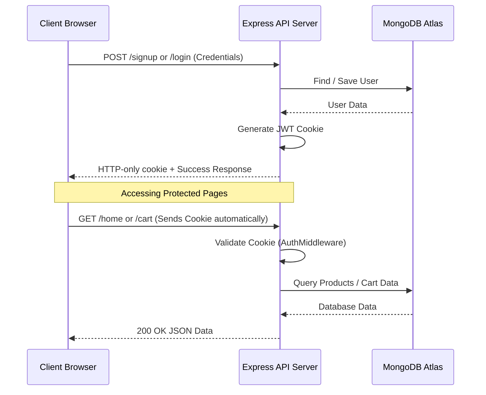

# 🌟 NexusMart — Fullstack eCommerce Application

A beautiful, feature-rich, and secure **Fullstack eCommerce Web Application** built with **React (Vite)** on the frontend and **Express.js (Node.js)** with **MongoDB Atlas** on the backend. It features secure JWT cookie-based session management, Google OAuth Login, OTP-based password reset via EmailJS, a detailed product catalog, interactive cart management, and order history tracking.

---

## 📋 Table of Contents
1. [Project Overview](#-project-overview)
2. [Key Features](#-key-features)
3. [Technologies Used](#-technologies-used)
4. [File Structure](#-file-structure)
5. [How It Works](#-how-it-works)
6. [Installation & Setup](#-installation--setup)
7. [Environment Variables](#-environment-variables)
8. [Usage Guide](#-usage-guide)
9. [Future Improvements](#-future-improvements)
10. [Conclusion](#-conclusion)

---

## 🔍 Project Overview

The **NexusMart eCommerce Project** provides a complete end-to-end user shopping experience. It connects a highly responsive frontend with a robust backend API to handle authentication, database queries, and cart operations. The store's product catalog is seeded from the popular [DummyJSON API](https://dummyjson.com/products) and managed dynamically in MongoDB Atlas.

---

## ⚡ Key Features

- 🔐 **Dual Authentication Options**: Sign up and log in using standard credentials (with salted password hashing via `bcrypt`) or via **Google OAuth / One-Tap Login**.
- 🛡️ **Secure HTTP-Only Cookies**: User session tokens (JWT) are stored securely in `httpOnly` cookies, shielding the application from Cross-Site Scripting (XSS) token theft.
- 🚦 **Route Guards & Protection**: Unauthenticated guests are automatically redirected away from protected pages (Home, Product Details, Cart, Orders) using frontend router guards and backend middleware verification.
- 🔑 **OTP Password Recovery**: Forgot password? Reset it securely using an OTP verification code sent directly via **EmailJS** integration.
- 📦 **Dynamic Product Catalog**: Browse items, view ratings, review availability statuses (In Stock, Low Stock, Out of Stock), and view detailed specifications for each product.
- 🛒 **Interactive Shopping Cart**: Add products, adjust quantities, group items, view real-time totals, and clear cart items. Updates are managed seamlessly using React Context API.
- 📄 **Order History Tracking**: Complete a purchase and view your active order records in a clean layout.

---

## 🛠️ Technologies Used

### Frontend (Client)
- **React (v19)** — Component-based UI library.
- **Vite** — High-performance frontend build tool.
- **TailwindCSS (v4)** — Utility-first styling framework.
- **React Router DOM (v7)** — Client-side application routing.
- **EmailJS** — Transactional email delivery directly from the client.
- **React Hot Toast** — Elegant, non-blocking toast notifications.
- **Embla Carousel** — Lightweight and smooth carousel layouts.

### Backend (Server)
- **Node.js & Express.js (v5)** — Backend application server and API router.
- **Mongoose (v9)** — Schema-based Object Data Modeling (ODM) library for MongoDB.
- **JSON Web Tokens (JWT)** — Stateless user session validation.
- **Bcrypt** — Highly secure password hashing algorithm.
- **Cookie-Parser** — Cookie reading middleware.
- **CORS** — Cross-Origin Resource Sharing handler with dynamic regex matching.

### Database
- **MongoDB Atlas** — Cloud-hosted NoSQL database.

---

## 📂 File Structure

```
eCommerce/
├── README.md                      # Professional project documentation
├── info.txt                       # Project features & task list
│
├── server/                        # Express Backend
│   ├── server.js                  # Application entry point & router setup
│   ├── .env                       # Backend environment configurations
│   ├── package.json               # Backend dependencies & scripts
│   ├── router/                    # Express Router files
│   │   ├── login_router.js        # Handles POST /login
│   │   ├── signup_route.js        # Handles POST /signup
│   │   ├── sendotp_router.js      # Handles POST /sendotp
│   │   ├── forgootpass_router.js  # Handles POST /forgotpass
│   │   ├── googlelogin_route.js   # Handles POST /googlelogin
│   │   ├── homepage_route.js      # Handles product, cart, & order APIs
│   │   └── logout_router.js       # Handles POST /logout
│   └── src/
│       ├── Productsdb.js          # MongoDB connection & Product schema
│       ├── userData.js            # User schema & Auth controllers
│       ├── add_to_cart.js         # Cart controller (CRUD operations)
│       ├── orders.js              # Order placement & retrieval controllers
│       ├── product_details.js     # Individual product query controller
│       ├── Fetch.js               # Database product seeder (unused)
│       └── middlewares/
│           └── Auth_middleware.js # HTTP-Only JWT Cookie verification
│
└── client/                        # React Frontend
    ├── index.html                 # HTML entry point
    ├── vite.config.js             # Vite configurations
    ├── package.json               # Frontend dependencies & scripts
    └── src/
        ├── main.jsx               # React entry point
        ├── App.jsx                # Router configuration & path mapping
        ├── index.css              # Global styling & Tailwind rules
        ├── navbar/
        │   └── Top_navbar.jsx     # Navigation bar (Logo, Cart Badge, Logout)
        ├── context/
        │   └── AppContext.jsx     # Global state context (cart quantity & search)
        └── Pages/
            ├── Home.jsx           # Dynamic product grid view
            ├── cartpg.jsx         # Cart items management
            ├── Orderpg.jsx        # Order list page
            ├── product_details.jsx# Single product specifications & gallery
            ├── check/
            │   └── PrivateRoute.jsx# Auth Route Guard component
            └── userEntry/
                ├── LogIn.jsx      # Login page with Google OAuth option
                ├── Signup.jsx     # Account creation page
                └── Forgot_pass.jsx# OTP email verification & password update
```

---

## 🔄 How It Works

Here is a simple look at the application's step-by-step logic:



1. **Authentication**: Users sign up or log in. The backend hashes the password using `bcrypt` and issues a secure JWT token, storing it inside an HTTP-only cookie.
2. **Session Guarding**: When a user accesses `/home`, `/home/cart`, or `/home/orders`, the `PrivateRoute` verifies their local logged-in state. Meanwhile, every API request automatically includes the cookie. The backend's `AuthMiddleware` verifies this token, rejecting unauthorized requests with a `401` status.
3. **Cart Operations**: Adding an item to the cart makes a `POST /cart` request. The backend appends the product's database `ObjectId` to the user's `cart` array. The Context API maintains a global count badge in the navbar.
4. **Ordering**: Checking out calls `POST /order`. The backend clears the cart and pushes the products into the user's `orders` array.
5. **Password Resets**: The user inputs their email, and the server generates a 4-digit OTP. The frontend sends this code to the user's email via EmailJS. Once the user enters the correct OTP, the client allows them to choose a new password, which is hashed and updated in MongoDB.

---

## 🚀 Installation & Setup

Follow these simple steps to run the application on your local machine:

### Prerequisites
- **Node.js** (version 18 or above)
- **MongoDB Atlas** account and database URI
- **EmailJS** account (for sending OTP emails)
- **Google Cloud Console** Developer credentials (for Google Sign-In)

### Step 1: Clone the Project
Open your terminal and navigate to the project directory:
```bash
git clone <repository-url>
cd "eCommerce"
```

### Step 2: Set Up the Backend Server
1. Navigate to the server folder:
   ```bash
   cd server
   ```
2. Install all required dependencies:
   ```bash
   npm install
   ```
3. Create a `.env` file inside the `server/` directory and configure it (see [Environment Variables](#-environment-variables)).
4. Start the backend development server:
   ```bash
   npm run dev
   ```
   *The server will start running on port `3000` (or the port defined in your `.env` file).*

### Step 3: Set Up the Frontend Client
1. Open a new terminal window and navigate to the client folder:
   ```bash
   cd client
   ```
2. Install all required dependencies:
   ```bash
   npm install
   ```
3. Create a `.env` file in the `client/` directory for any React environment variables.
4. Start the frontend development server:
   ```bash
   npm run dev
   ```
   *Vite will compile the code and serve the app locally at `http://localhost:5173`.*

---

## 🔑 Environment Variables

To run this project securely, create `.env` files in both the frontend and backend directories.

### Backend Configurations (`server/.env`)
```env
PORT=3000
MONGO_URI=mongodb+srv://<username>:<password>@<cluster>.mongodb.net/<database_name>
JWT_SECRET=your_jwt_signing_secret_key
```

### Frontend Configurations (`client/.env`)
```env
VITE_GOOGLE_CLIENT_ID=your_google_oauth_client_id.apps.googleusercontent.com
VITE_EMAILJS_SERVICE_ID=your_emailjs_service_id
VITE_EMAILJS_TEMPLATE_ID=your_emailjs_template_id
VITE_EMAILJS_PUBLIC_KEY=your_emailjs_public_key
```

---

## 💡 Usage Guide

### 1. Creating an Account
- Navigate to `http://localhost:5173/signup`.
- Fill in your name, email, and password, or click **Sign Up with Google**.
- Upon success, you are logged in automatically and redirected to the `/home` catalog page.

### 2. Browsing Products
- Once logged in, you can view all available products on the catalog page.
- Hover over products to see details or search for specific items using the search bar in the navbar.
- Click on any product to view its detailed page, showing rating stars, stock status, return policies, dimensions, and reviews.

### 3. Using the Cart
- Click **Add to Cart** on any product item.
- The cart item count badge on the navigation bar updates in real time.
- Navigate to the **Cart** page to see your items, increase/decrease quantities, or remove items.

### 4. Placing Orders
- From the Cart page, review your list and click **Place Order**.
- Your cart will clear, and your items will be saved as official orders.
- Navigate to the **Orders** page to view your purchase history.

### 5. Resetting Password
- If you forget your password, click **Forgot Password?** on the login page.
- Enter your email and click **Send OTP**.
- Input the 4-digit code sent to your inbox.
- Enter your new password and submit. You can now log in using your new credentials.

---

## 📈 Future Improvements

Here are a few features that could be added next:
- **Server-Side OTP Verification**: Move the OTP generation and verification to the backend using `nodemailer` for enhanced security.
- **Payment Gateway Integration**: Secure payment checkouts using Stripe, PayPal, or Razorpay.
- **Product Search & Filter**: Integrate backend database text searches and filters by category, price range, and product ratings.
- **Admin Dashboard**: Create a secure panel for store administrators to manage products, categories, and review customer orders.
- **Infinite Scrolling & Pagination**: Optimize load performance for thousands of products.

---

## 🏁 Conclusion

This **Fullstack eCommerce application** serves as an excellent demonstration of modern web engineering. Combining secure HTTP-only cookie session management, dynamic data operations in MongoDB Atlas, and a responsive frontend built in React, Vite, and TailwindCSS, it provides a solid foundation for any eCommerce platform.

Enjoy coding and building on top of this project! 🚀
